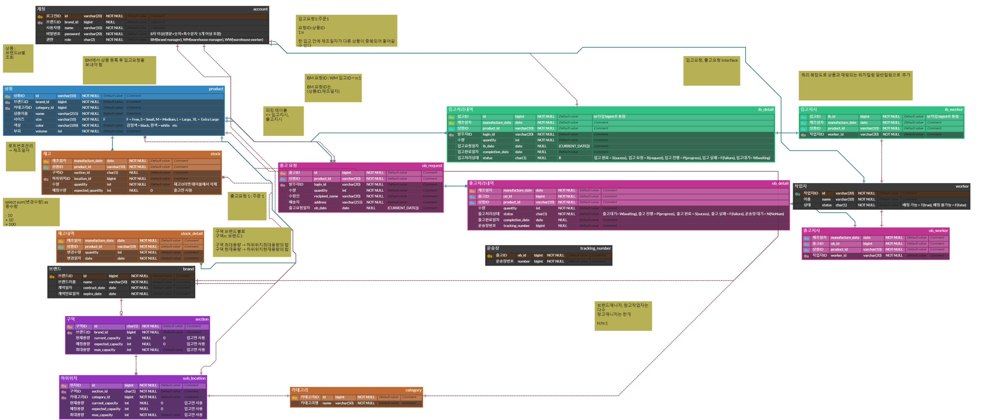
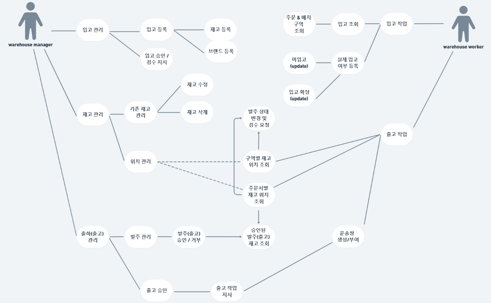

# 📦 웁신사 WMS System

## 🏦 프로젝트 소개

1. **주제 - 창고 관리 시스템**: 상품 입출고 요청에 따른 재고 수량 및 창고 용량 관리 기능을 중점으로, 효율적인 창고관리 및 입출고 처리가 가능한 창고관리 시스템 입니다. 브랜드 매니저는 상품등록, 상품 입출고 요청 및 재고조회를 할 수 있으며 창고 매니저는 입출고 요청을 관리하고 이에 따라 작업자에게 작업을 지시합니다. 창고 작업자는 실제 입/출고처리를 진행합니다.

## 팀원 구성
김나경, 변성일, 이영우, 정성연, 정예진, 김홍현(..?)

## Stack

- Programming : 
- DB :  
- 협업 툴 :     
- ERD 다이어그램 : 

## 프로젝트 구조
### ERD

### 유스케이스 다이어그램

- 브랜드 매니저(BM)

- 창고 매니저(WM), 창고 작업자(WW)

## 역할분담
- 김나경 : 업무분석, 입고 서비스, 창고 작업자(WW), PPT, 발표
- 변성일 : ERD, 창고 매니저(WM)
- 이영우 : 브랜드 매니저(BM), README
- 정성연 : 유스케이스 다이어그램, 창고 매니저(WM), 기획서
- 정예진 : 시퀀스 다이어그램, 창고 작업자(WW),
- 김홍현 : 클래스 다이어그램, 창고작업자(WW)

## 개발기간 및 작업관리
- 개발기간 : 2024-05-15 ~ 2024-05-22
- 작업관리 : 노션 및 깃허브를 이용한 작업관리

## 📌 주요기능

[//]: # (앱이 3개이므로 3개 각각 큰 기능들 소개)

#### 👕 브랜드 매니저(BM)
##### 1️⃣ 상품 등록
- 입고요청을 하기 전에 상품을 등록해야 합니다.

##### 2️⃣ 입고 요청 및 조회
- 등록한 상품에 대한 입고 요청을 보낼 수 있습니다.
- 사용자의 입고 요청을 조회할 수 있습니다.

##### 3️⃣ 출고 요청 및 조회
- 상품에 대한 출고 요청을 보낼 수 있습니다.
- 사용자의 출고 요청에 대한 처리상태를 조회할 수 있습니다.

#### 4️⃣ 재고 조회
- 입고된 상품의 전체 재고를 조회할 수 있습니다.
- 입고된 상품의 재고를 카테고리별로 조회할 수 있습니다.
- 입고된 상품의 재고를 상품ID별로 조회할 수 있습니다.

---
#### 📦 창고 매니저(WM)

##### 1️⃣ 입고 요청 조회 및 입고 처리상태 업데이트
- 브랜드 매니저가 등록한 입고 요청을 조회할 수 있습니다.
- 입고 처리상태를 변경할 수 있습니다.

##### 2️⃣ 입고작업 지시
- 창고 작업자에게 입고 요청에 따른 입고 작업을 지시합니다.

##### 3️⃣ 출고 요청 조회 및 출고 처리상태 업데이트
- 브랜드 매니저가 등록한 출고 요청을 조회할 수 있습니다.
- 출고 처리상태를 변경할 수 있습니다.

##### 4️⃣ 출고작업 지시
- 창고 작업자에게 출고 요청에 따른 출고 작업을 지시합니다.
---
#### 🦺 창고 작업자(WW)

##### 1️⃣ 입/출고지시 조회
- 창고 매니저로부터 할당 받은 입/출고 지시를 조회할 수 있습니다.

##### 2️⃣ 입/출고지시 작업 및 상태 업데이트
- 입고 지시에 따라 상품을 지정된 위치에 보관합니다.
- 출고 지시에 따라 상품을 지정된 위치에서 피킹합니다.
- 입/출고 작업에 따라 상태(완료, 반려)를 변경할 수 있습니다.

##### 3️⃣ 재고 업데이트
- 입고완료된 상품의 재고를 변경합니다.
- 출고완료된 상품의 재고를 변경합니다.

[//]: # (## 프로젝트 후기)

